

---

<h2> Resources </h2>

- For the pdf document that has the exercice statement please refer to [Exercices-JSP-Servlet](../Resources/Work-Series/TP%20N°2_Composant%20Web_JSP.pdf) 😊

- As for the `walkthrough`, here, I have created a `PDF` that will serve as a guide through the various exercises found in the exercise document linked above! 🦈 [JSP-Servlet-Doc](../Resources/My-Docs/JSP-Servlet-Project-Doc.pdf)

---

<h2> Project Showcase </h2>

In this section, I'll showcase the final project output. Just take a seat and explore the screens and functionalities implemented in the Struts Introduction Project. 🚀

> Index, page ( Home )
> 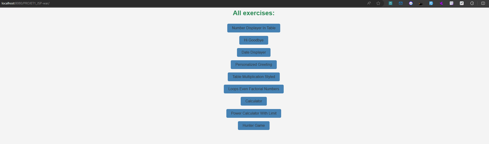

> Number Displayer 🍂
> 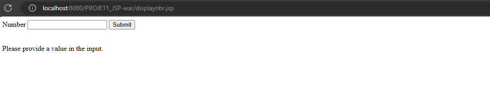 > 

> Hi, goodbye 🍂 (status is set to true => Hello Friend)
> 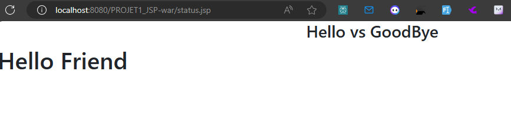

> Date Displayer 🍂 (Display current date 🍀)
> 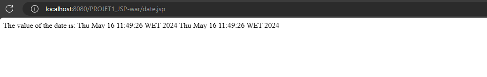

> Personnalized greeting ⭐
> 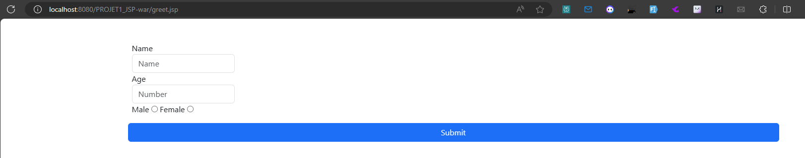 > 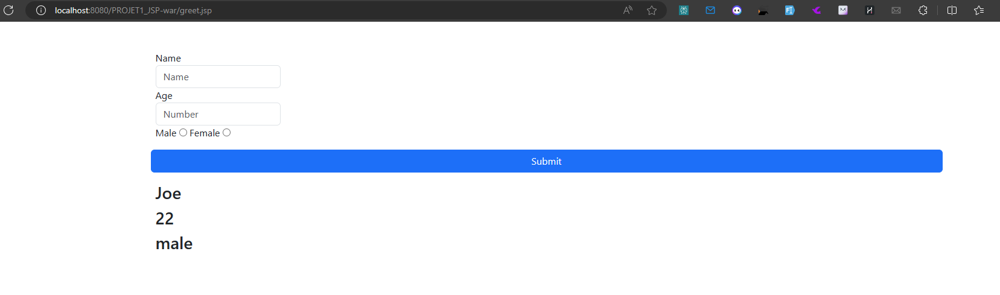

> Table Multiplication Styled ⭐
> 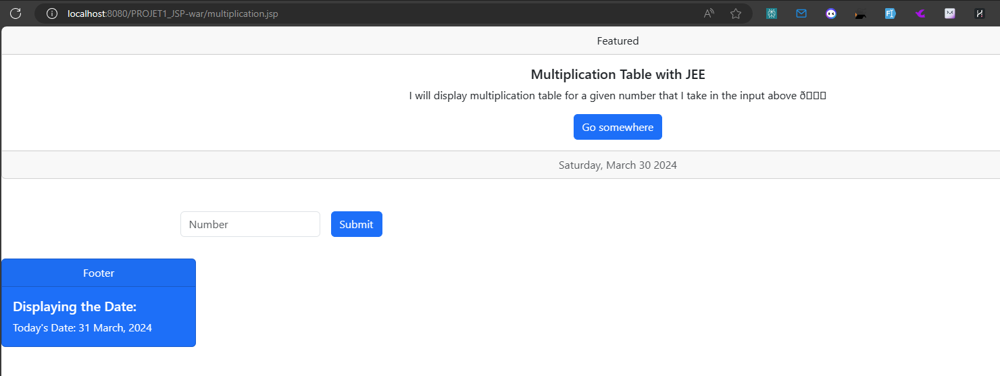
> We inputed 43, maybe needs more styling and fixing 🐬
> 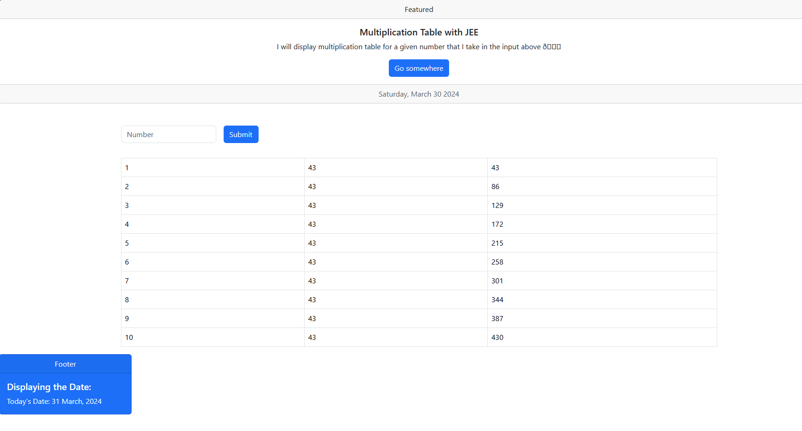

> Loops Even Factorial Numbers 📖
> 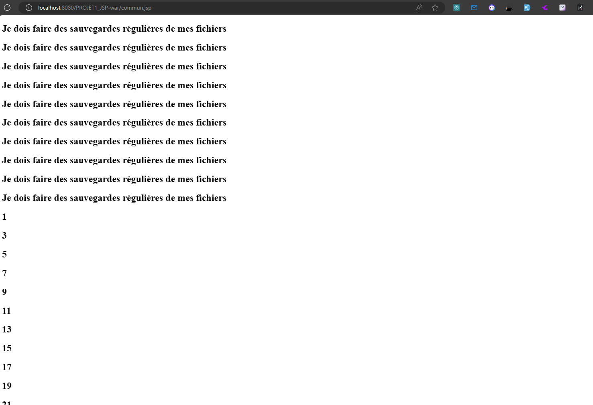

> Calculator 🏁
> 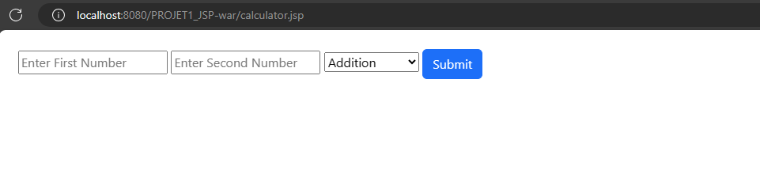
> After inputing 23 and 15 and choosing Addition 🦈
> 

> Power Calculator with Limit 🎯🏁
> 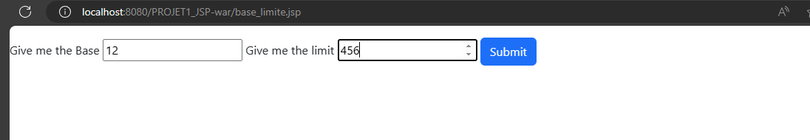
> We gave it the base, and it's gonna calculate the power and return the result that are less than the limit 🏁
> 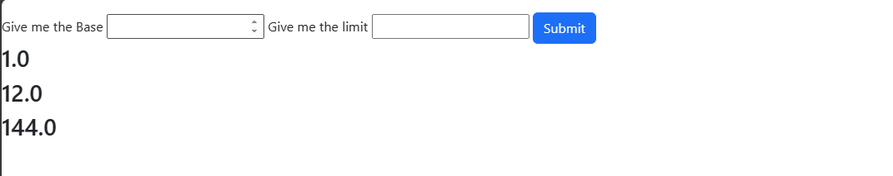

> Hunter Game 🐰
> 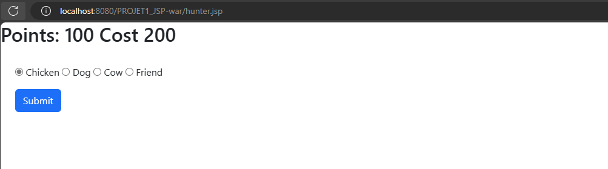
> Each type takes an amount of points 🍀
> 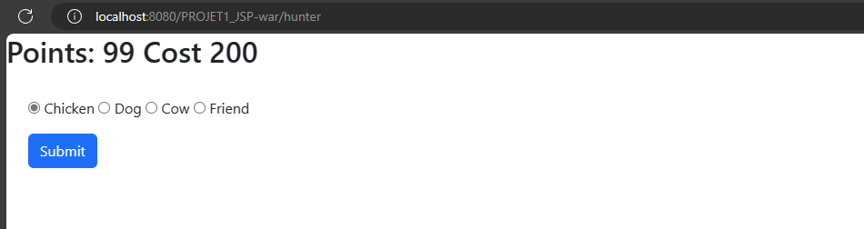
> Here we clicked on friend, with an amount of 10 points ⭐
> 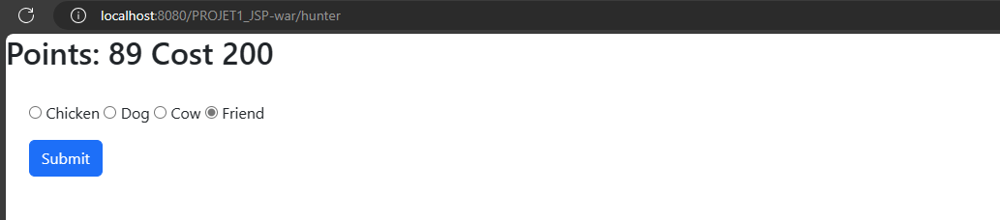

---

<h2> Author </h2>

- [`@Josh-techie`](https://github.com/Josh-techie) | Software Engineer Student

  > Reach out to me if you need any help or have any questions.

  
   | 
    
     | 
    
