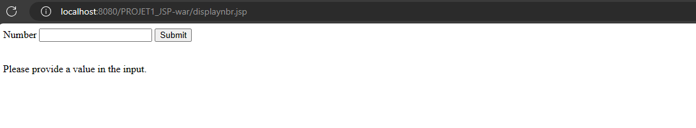
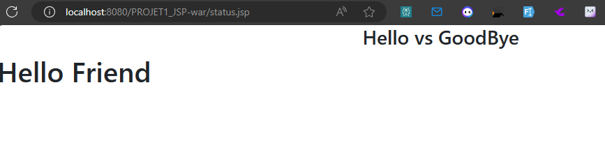
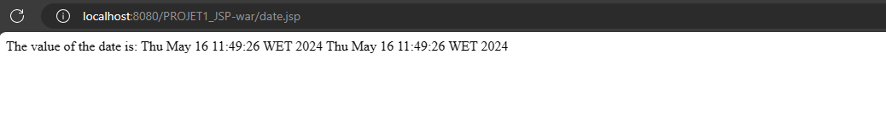

---

<h2> Resources </h2>

- For the pdf document that has the exercice statement please refer to [Exercices-JSP-Servlet](../Resources/Work-Series/TP%20N°2_Composant%20Web_JSP.pdf) 😊

- As for the `walkthough`, there's none for this as it's just an introduction, we're not really following an exercice 😅
  > Maybe, I have I'll have to llok for it later !

---

<h2> Project Showcase </h2>

In this section, I'll showcase the final project output. Just take a seat and explore the screens and functionalities implemented in the Struts Introduction Project. 🚀

> Index, page ( Home )
> 

> Number Displayer 🍂
> 
> 

> Hi, goodbye 🍂 (status is set to true => Hello Friend)
> 

> Date Displayer 🍂 (Display current date 🍀)
> 

> Personnalized greeting ⭐
> 
> 

